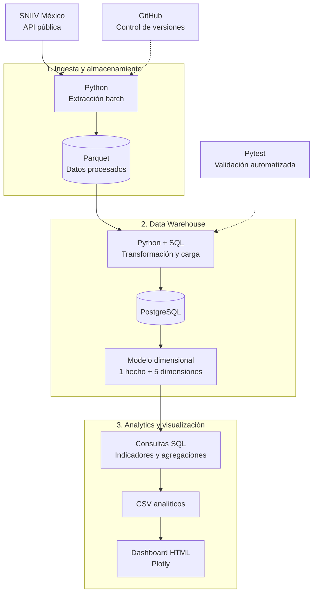

# Arquitectura de datos — SNIIV

Diagrama de alto nivel del pipeline batch y su capa analítica.


```mermaid
flowchart TB
A["SNIIV México<br/>API pública"]

subgraph ING["1. Ingesta y almacenamiento"]
    B["Python<br/>Extracción batch"]
    C[("Parquet<br/>Datos procesados")]
end

subgraph DW["2. Data Warehouse"]
    D["Python + SQL<br/>Transformación y carga"]
    E[("PostgreSQL")]
    F["Modelo dimensional<br/>1 hecho + 5 dimensiones"]
end

subgraph BI["3. Analytics y visualización"]
    G["Consultas SQL<br/>Indicadores y agregaciones"]
    H["CSV analíticos"]
    I["Dashboard HTML<br/>Plotly"]
end

A --> B --> C --> D --> E --> F
F --> G --> H --> I

T["Pytest<br/>Validación automatizada"] -.-> D
V["GitHub<br/>Control de versiones"] -.-> B
```
```
